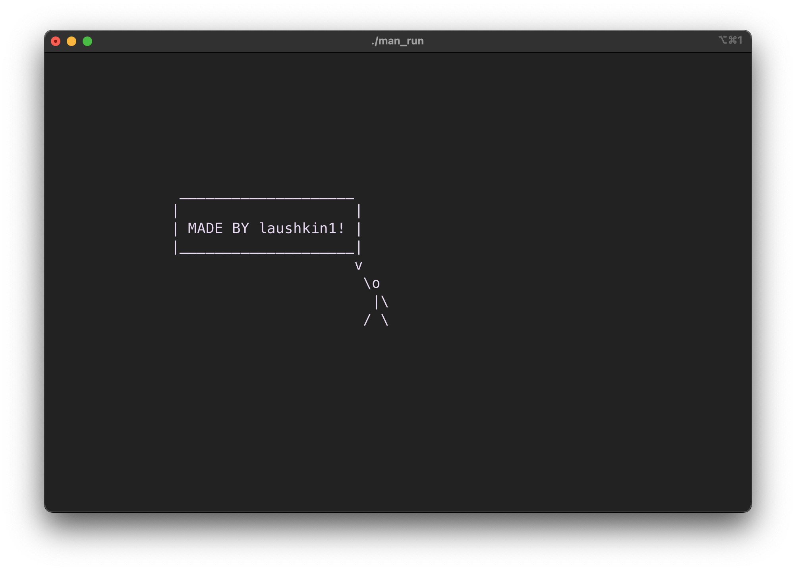

# Man
Man made on C with ncurses

## How to use?
To run `man_run.c` file you need follow commands
```bash
make
./man_run
```

## Control
`w` - Go up

`s` - Go Down

`a` - Go Left

`d` - Go Right


`w`/`s`/`a`/`d` + `shift` - Sprint


`q` - Raise left hand up

`e` - Raise right hand up


`q`/`e` + `shift` - Lift left/right hand 

`esc` - exit

## Author
- [@laushkin1](https://github.com/laushkin1)


